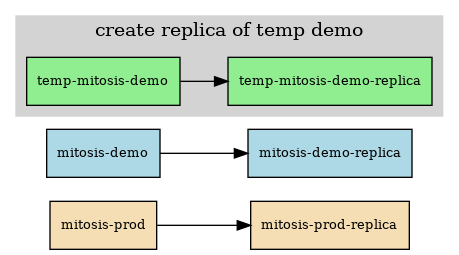

# stack-mitosis

[](https://circleci.com/gh/dgtized/stack-mitosis)

Clone and redeploy an AWS RDS instance to propagate a production dataset to
downstream environments like staging or demo. This allows staging to maintain
data parity with production in a throw-away environment.

## Process

Given an environment where both `mitosis-prod` and `mitosis-demo` have a database and a replica:


Stack mitosis will clone `mitosis-prod` into a new replica `temp-mitosis-demo`.


It then promotes `temp-mitosis-demo` to disconnect from the replication graph of `mitosis-prod`.


Once `temp-mitosis-demo` is an independent replication graph, create a new replica of it called `temp-mitosis-demo-replica`. 



It will then rename the existing `mitosis-demo` graph to prefix with `old-`.


Once that is complete, it's safe to rename the `temp-`
prefixed clones back to `mitosis-demo` and `mitosis-staging-demo`.


stack-mitosis will restart the demo application using a provided script, and
then delete the `old-` prefixed replication graph.


# Install

After installing a JDK, follow the [clojure install
instructions](https://clojure.org/guides/getting_started) for your environment
to ensure `clj` and `clojure` are in path.

# Credentials

Stack mitosis uses [aws-api](https://github.com/cognitect-labs/aws-api) to
interact with AWS. That uses the same [credentials
preferences](https://docs.aws.amazon.com/sdk-for-java/v1/developer-guide/credentials.html)
as the AWS Java client. However, stack-mitosis also supports using STS and
prompting for a MFA token to authorize use of a limited role for the duration of
the operation.

In order to support that the following environment variables need to be present;
`AWS_CONFIG_FILE`, `AWS_CREDENTIAL_PROFILES_FILE` should be set to specify any
credentials other than `.aws/credentials`. For the initial handshake with AWS,
credentials are needed from those files, or from environment variables,
`AWS_ACCESS_KEY_ID`, `AWS_SECRET_ACCESS_KEY`, and `AWS_REGION`. In order to
select an assumed role using an MFA token, for now a `role.edn` file should be
specified with the following values:

```
{:mfa-serial "arn:aws:iam::1234:mfa/username"
 :role-arn "arn:aws:iam::1234:role/sudo"
 :region "us-west-1"}
```

Hopefully in the future this can be parsed directly from the `AWS_CONFIG` file.

# Usage

    clj -m stack-mitosis.cli \
        --source mitosis-production --target mitosis-staging \
        --restart "./restart-service.sh"
        --credentials resources/role.edn
        [--plan]

# Testing

    bin/kaocha # basic unit tests
    bin/kaocha --plugin cloverage # with coverage output
